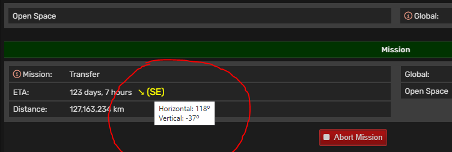

# AtmoBurn Services - Show Fleet Direction
This is Tampermonkey (https://www.tampermonkey.net/) script for Atmoburn game (https://www.atmoburn.com/).

## What it does
Displays horizontal (arrows, compas) & vertical (degrees) fleet direction (see screenshot).

## How to install
- You should have Tampermonkey (https://www.tampermonkey.net/) or equivalent
- Open `abs-fleet-direction.user.js` file and go "Raw" in your browser - Tampermonkey should offer you "Install" button - and thats it.

## How to use
Open fleet with active mission and look for yello arrow/text in Mission section/ETA (see screenshot).
Also works before launching the fleet.
Tooltip gives (almost) exact horizontal and vertical directions in degrees.

## Screenshots

