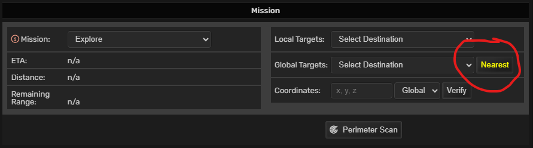

# AtmoBurn Services - Shorter 'Nearest unexplored system' button
This is Tampermonkey (https://www.tampermonkey.net/) script for Atmoburn game (https://www.atmoburn.com/).

## What it does
Make button "Nearest unexplored system" shorter, and yellow, for better orientation.

## How to install
- You should have Tampermonkey (https://www.tampermonkey.net/) or equivalent
- Open `abs-shorter-explore-nearest-button.user.js` file and go "Raw" in your browser - Tampermonkey should offer you "Install" button - and thats it.

## How to use
Open fleet screen and look for yellow button labeled "Nearest". That's it.

## Screenshots

