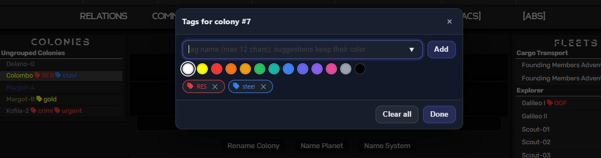

# AtmoBurn Services - Tag Manager
This is Tampermonkey (https://www.tampermonkey.net/) script for Atmoburn game(https://www.atmoburn.com/).

## What it does
Simple colony and fleet tagging script. Just that.

## How to use
 1. Open colony or fleet screen.
 2. Use ALT-T for tag management
 3. Add/remove tag(s)
 4. Refresh screen and check your colony and/or fleet menu (left/right column)

## How it is implemented
This script uses only local (script) storage, i.e. GM_setValue/GM_getValue.
Once installed, see your Tampermonkey menu / Storage tab, where you can see your (raw) data (in JSON format). You can even edit it.

## Status
> [!WARNING]
> This is still under development. Beware!

## Known bugs
- deleting last tag does not remove it from the fleet/colony list, refreshing the page is needed
- once tag is added, you can't change a color, nor create same tag (by name) with other color; tag identity should by defined by name/color pair, not only by name

## TODO list
- add icon to open Tag Manager, not only ALT-T
- show tags in other contexts - colony/fleet overview, global targes etc
- add filtering by tags - hide all NOT having the tag, hide all HAVING the tag
- more colors/custom colors, customize size/style for tags
- AUTOTAGS! Add criteria for autotagging, for example 
  - when happines < 40 then add "Health" red tag
  - when iron < 10k then add "RES" red tag
  - when gold > 100k then add "RES" green tag
  - when fleet has less then 10% of max fuel then "OOF" (out-of-fuel) tag

## Screenshots
As an example:
